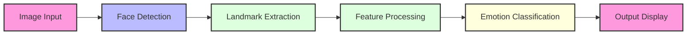
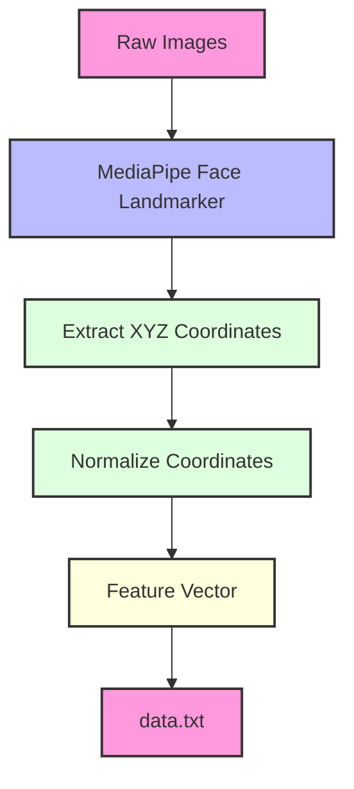
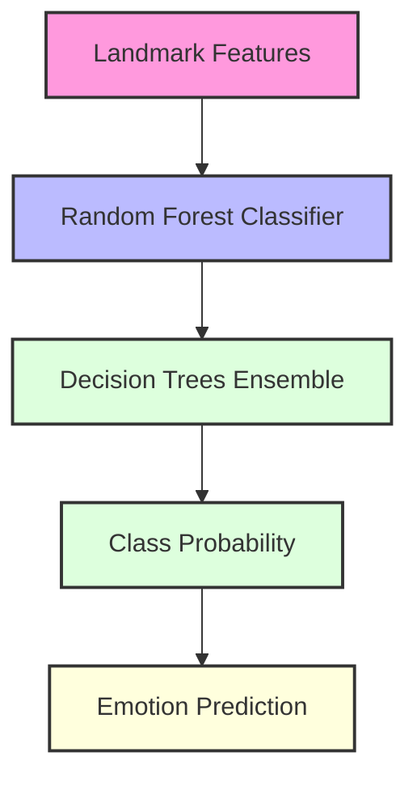
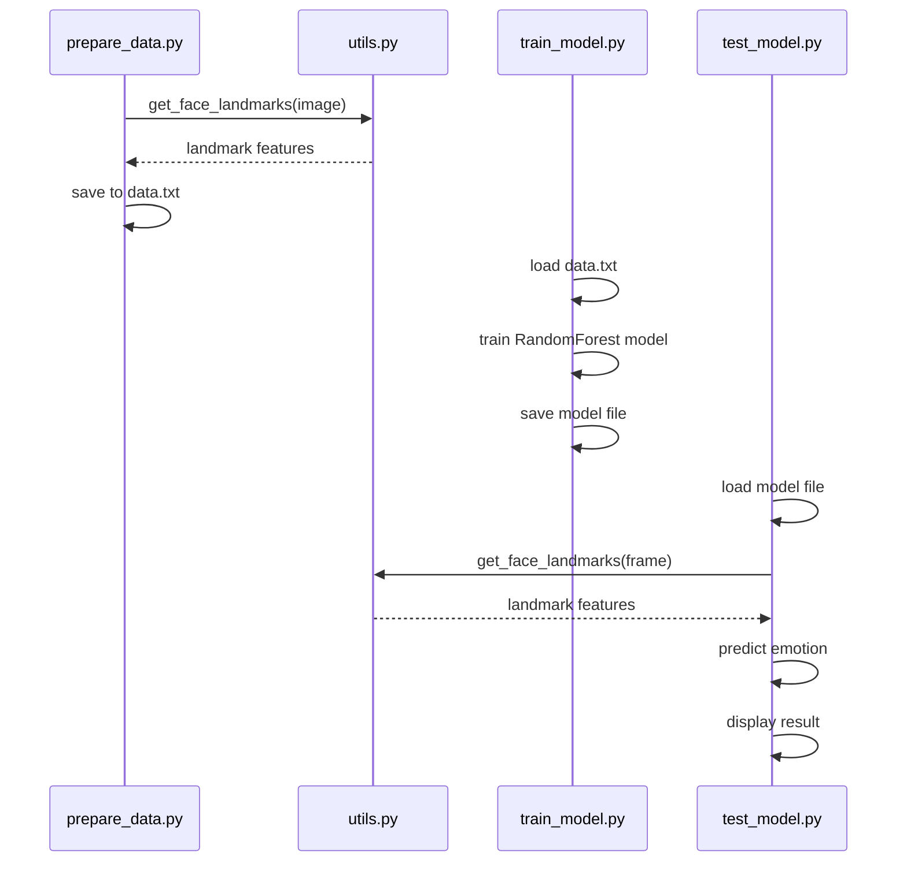

### Templates for ARCHITECTURE.md, TODO.md, and ROADMAP.md

#### ARCHITECTURE.md Template
This file outlines the high-level structure of your project, including its components, data flow, and key design decisions.

```markdown
# Architecture Documentation

## System Overview

This project implements a facial emotion detection system using MediaPipe for facial landmark extraction and a Random Forest classifier for emotion prediction.



## Component Details

### 1. Data Pipeline



### 2. Model Architecture



## Key Components

### MediaPipe Integration (`utils.py`)

The system uses MediaPipe's Face Landmarker task to extract 468 3D facial landmarks. Each landmark has X, Y, Z coordinates, resulting in 1,404 features per face.

```python
# Key component: Face landmark detection
def get_face_landmarks(image, draw=False):
    # Convert BGR to RGB
    image_input_rgb = cv2.cvtColor(image, cv2.COLOR_BGR2RGB)

    # Create mp.Image from numpy array
    mp_image = mp.Image(image_format=mp.ImageFormat.SRGB, data=image_input_rgb)

    # Detect landmarks
    results = landmarker.detect(mp_image)
    # Process landmarks...
```

### Data Preparation (`prepare_data.py`)

Processes the training dataset by:
1. Downloading from KaggleHub if needed
2. Extracting and reorganizing into train/test directories
3. Processing each image to extract facial landmarks
4. Saving landmark features with emotion labels to data.txt

### Model Training (`train_model.py`)

Trains a Random Forest classifier on the extracted features:
1. Loads feature vectors from data.txt
2. Splits into training and testing sets
3. Trains the Random Forest classifier
4. Evaluates performance with accuracy and confusion matrix
5. Saves the trained model

### Real-time Testing (`test_model.py`)

Implements real-time emotion detection:
1. Loads the trained model
2. Captures video frames from webcam
3. Extracts facial landmarks from each frame
4. Classifies emotions based on landmarks
5. Displays result on video feed

## Data Flow



## Technical Specifications

- **Face Detection & Landmark Extraction**: MediaPipe Face Landmarker task
- **Feature Count**: 1,404 features (468 landmarks × 3 coordinates)
- **Model**: RandomForestClassifier from scikit-learn
- **Emotion Classes**: angry, disgust, fear, happy, neutral, sad, surprise
- **Input Processing**: OpenCV for image processing, webcam capture
- **Performance Metrics**: Accuracy and confusion matrix
```

