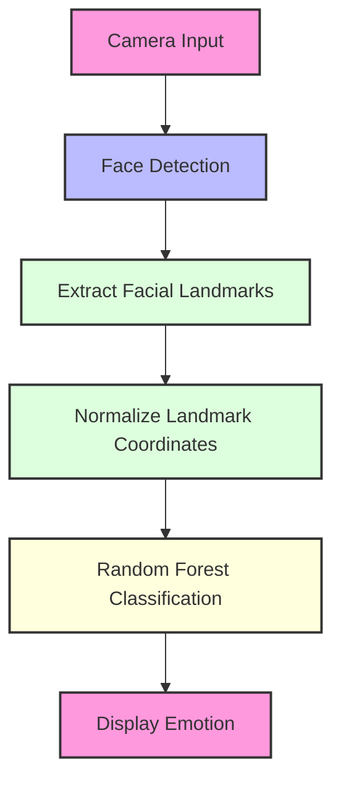

# Facial Emotion Detection

<div align="center">


A computer vision application that detects and classifies facial emotions in real-time using MediaPipe face landmarks and Random Forest classification.

</div>


## 📖 Table of Contents

- [Facial Emotion Detection](#facial-emotion-detection)
	- [📖 Table of Contents](#-table-of-contents)
	- [✨ Features](#-features)
	- [🚀 Quick Start](#-quick-start)
	- [📥 Installation](#-installation)
		- [Prerequisites](#prerequisites)
		- [Using the Setup Script (Windows)](#using-the-setup-script-windows)
		- [Manual Installation](#manual-installation)
	- [💻 Usage](#-usage)
		- [Data Preparation](#data-preparation)
		- [Training the Model](#training-the-model)
		- [Real-time Testing](#real-time-testing)
	- [🔍 How It Works](#-how-it-works)
	- [📁 Project Structure](#-project-structure)
	- [🛠 Technologies](#-technologies)
	- [📈 Development Roadmap](#-development-roadmap)
	- [👥 Contributing](#-contributing)
		- [Ways to Contribute](#ways-to-contribute)
		- [Contribution Process](#contribution-process)
		- [Code Style](#code-style)
		- [Recognition](#recognition)
	- [📄 License](#-license)

## ✨ Features

- **Real-time emotion detection** from webcam feed
- Supports **7 emotions**: angry, disgust, fear, happy, neutral, sad, surprise
- Uses **468 facial landmarks** (1,404 features in 3D space)
- **Cross-platform** compatibility (Windows, macOS, Linux)
- **Optimized** for real-time performance

## 🚀 Quick Start

```bash
# Clone the repository
git clone https://github.com/yourusername/facial-emotion-detection.git
cd facial-emotion-detection

# Install dependencies
pip install -r requirements.txt

# Download and prepare dataset (first-time only)
python prepare_data.py

# Train the model (first-time only)
python train_model.py

# Run real-time emotion detection
python test_model.py
```

Press `q` to quit the application.

## 📥 Installation

### Prerequisites

- Python 3.6+
- pip (Python package manager)
- Webcam

### Using the Setup Script (Windows)

```powershell
# Option 1: Run with bypass for current session
powershell -ExecutionPolicy Bypass -File install_requirements.ps1

# Option 2: Run with admin privileges
powershell -Command "& {Start-Process PowerShell -ArgumentList '-ExecutionPolicy Bypass -File install_requirements.ps1' -Verb RunAs}"
```

### Manual Installation

```bash
# Create and activate virtual environment (optional but recommended)
python -m venv venv
source venv/bin/activate  # On Windows: venv\Scripts\activate

# Install dependencies
pip install -r requirements.txt
```

## 💻 Usage

### Data Preparation

The first time you run the project, you'll need to download and prepare the dataset:

```bash
python prepare_data.py
```

This script:
- Downloads a facial emotion dataset using KaggleHub
- Organizes images into train/validation directories
- Processes faces to extract landmarks
- Creates a data file with features and labels

### Training the Model

After data preparation, train the emotion classification model:

```bash
python train_model.py
```

This will:
- Load the processed landmark features
- Train a Random Forest classifier
- Evaluate model performance
- Save the trained model

### Real-time Testing

Once the model is trained, run the real-time detection:

```bash
python test_model.py
```

If you have multiple cameras, you may need to change the camera index in the script.

## 🔍 How It Works



1. **Face Detection**: MediaPipe detects faces in each frame
2. **Landmark Extraction**: 468 facial landmarks are identified
3. **Feature Engineering**: Landmarks are normalized and processed
4. **Classification**: Random Forest model predicts the emotion
5. **Visualization**: Emotion label is displayed on the video feed

## 📁 Project Structure

```
facial-emotion-detection/
├── data/                       # Dataset directory
│   ├── train/                  # Training images by emotion
│   └── validation/             # Validation images by emotion
├── prepare_data.py             # Dataset preparation script
├── train_model.py              # Model training script
├── test_model.py               # Real-time testing script
├── utils.py                    # Utility functions
├── face_landmarker.task        # MediaPipe face landmark model
├── data.txt                    # Processed landmark features
├── model                       # Trained classifier
├── requirements.txt            # Python dependencies
├── ARCHITECTURE.md             # Technical architecture details
├── ROADMAP.md                  # Development roadmap
├── TODO.md                     # Task tracking
├── install_requirements.ps1    # Windows installation script
└── README.md                   # Project documentation
```

## 🛠 Technologies

- **MediaPipe**: Face detection and landmark extraction
- **OpenCV**: Image and video processing
- **scikit-learn**: Machine learning algorithms
- **NumPy**: Numerical operations
- **KaggleHub**: Dataset download

## 📈 Development Roadmap

See the [ROADMAP.md](ROADMAP.md) file for the complete development plan.

- [x] **Phase 1**: Core Implementation
  - [x] Project setup and data preparation
  - [x] Face landmark detection
  - [x] Model training
  - [x] Real-time testing

- [ ] **Phase 2**: Model Enhancement
  - [ ] Hyperparameter tuning
  - [ ] Multi-face support
  - [ ] Performance optimization

- [ ] **Phase 3**: Feature Expansion
  - [ ] Alternative model architectures
  - [ ] Web application integration
  - [ ] Video file processing

## 👥 Contributing

Contributions to this project are welcome and appreciated! By contributing, you agree to license your work under the same license as this project.

### Ways to Contribute

- **Report bugs**: Create an issue describing the bug and how to reproduce it
- **Suggest enhancements**: Open an issue with feature ideas or improvements
- **Submit pull requests**: Implement new features or fix bugs
- **Improve documentation**: Fix typos, add examples, or clarify explanations
- **Share the project**: Help others discover this tool

### Contribution Process

1. Fork the repository
2. Create a feature branch (`git checkout -b feature/amazing-feature`)
3. Make your changes (and ensure they follow project style guidelines)
4. Add tests for your changes if applicable
5. Run existing tests to ensure nothing broke
6. Commit your changes with a descriptive message (`git commit -m 'Add some amazing feature'`)
7. Push to your branch (`git push origin feature/amazing-feature`)
8. Open a Pull Request with a detailed description

### Code Style

- Follow the existing code style and organization
- Add comments to explain complex logic
- Use descriptive variable names
- Keep functions small and focused on a single task

### Recognition

Contributors will be acknowledged in the project documentation. Your contributions make this project better for everyone!

## 📄 License

This project is licensed under the Attribution License - see the [LICENSE.md](LICENSE.md) file for details.

**Important**: If you use this project, you must give appropriate credit by including the name of the creator in your documentation and user interface.

---

<div align="center">
  <p>Made with ❤️ by <a href="https://github.com/yourusername">Your Name</a></p>
  <p>
    <a href="https://twitter.com/yourusername">
      
    </a>
    <a href="https://www.linkedin.com/in/yourusername">
      
    </a>
  </p>
</div>
