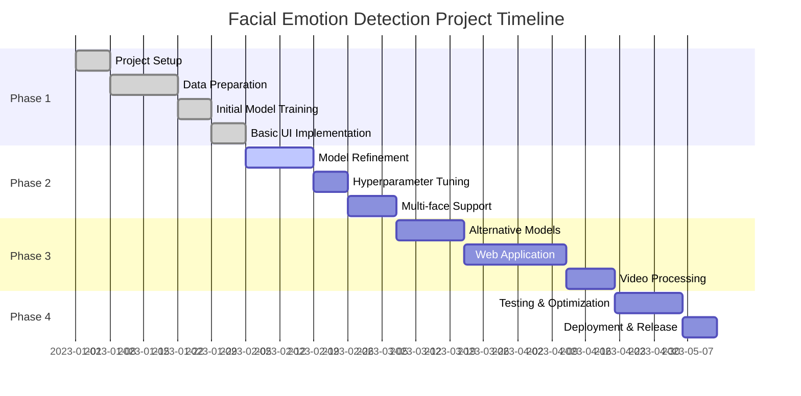

# Project Roadmap

This document outlines the planned development roadmap for the Facial Emotion Detection project.

## Project Timeline

## Completed Milestones

### Phase 1: Core Implementation ✅

- [x] **Project Setup**
  - [x] Initialize repository structure
  - [x] Set up dependency management
  - [x] Create documentation framework

- [x] **Data Preparation**
  - [x] Download and organize dataset
  - [x] Implement face landmark extraction
  - [x] Process and normalize features
  - [x] Generate training data

- [x] **Initial Model Training**
  - [x] Implement RandomForest classifier
  - [x] Train on facial landmark features
  - [x] Evaluate basic performance metrics
  - [x] Save trained model

- [x] **Basic UI Implementation**
  - [x] Real-time webcam integration
  - [x] Live emotion detection display
  - [x] Basic user controls

## Current Development

### Phase 2: Model Enhancement 🔄

- [ ] **Model Refinement**
  - [ ] Analyze error patterns
  - [ ] Improve feature selection
  - [ ] Implement cross-validation
  - [ ] Optimize preprocessing steps

- [ ] **Hyperparameter Tuning**
  - [ ] Grid search for optimal parameters
  - [ ] Experiment with feature scaling methods
  - [ ] Optimize model for real-time performance
  - [ ] Improve accuracy metrics

- [ ] **Multi-face Support**
  - [ ] Update detection algorithm for multiple faces
  - [ ] Implement face tracking
  - [ ] Optimize parallel processing
  - [ ] Add UI support for multiple detections

## Future Plans

### Phase 3: Feature Expansion 🔜

- [ ] **Alternative Models**
  - [ ] Implement CNN-based approach
  - [ ] Add SVM classifier option
  - [ ] Ensemble method integration
  - [ ] Compare performance metrics

- [ ] **Web Application**
  - [ ] Create Flask/FastAPI backend
  - [ ] Develop React frontend
  - [ ] Implement WebRTC for camera access
  - [ ] Add user account management

- [ ] **Video Processing**
  - [ ] Add support for video file input
  - [ ] Implement batch processing
  - [ ] Add emotion timeline tracking
  - [ ] Create export functionality for results

### Phase 4: Productionization 🔜

- [ ] **Testing & Optimization**
  - [ ] Comprehensive performance testing
  - [ ] Memory usage optimization
  - [ ] Processing speed improvements
  - [ ] Cross-platform compatibility

- [ ] **Deployment & Release**
  - [ ] Package application
  - [ ] Create installation guides
  - [ ] Final documentation
  - [ ] Release v1.0
